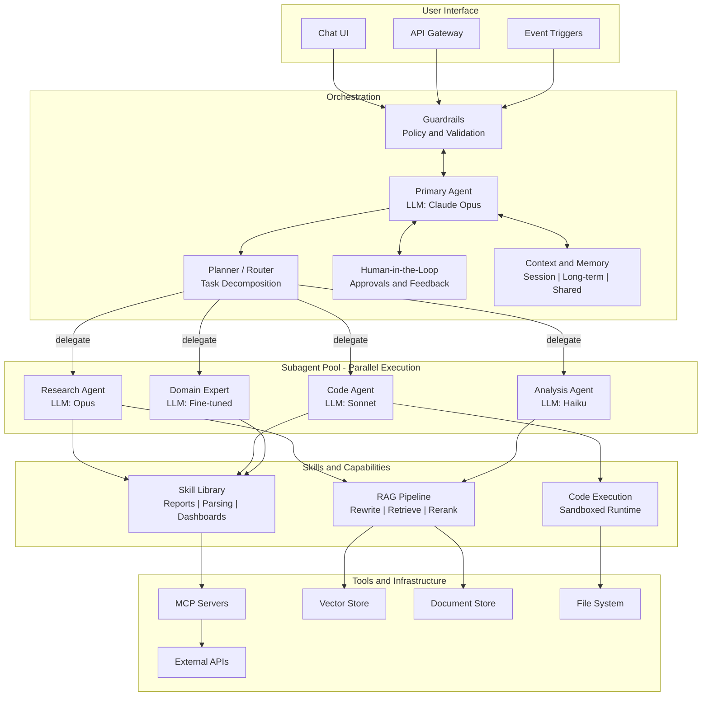

# Agentic AI Reference Architecture

A layered reference architecture for agentic AI systems, illustrating orchestration, multi-model routing, skills, RAG, tool use, and safety patterns.
---

---
## Architecture Layers

### 1. User Interface
Entry points into the agentic system. Users interact via conversational chat, programmatic API calls, or automated event triggers (scheduled jobs, webhooks).

### 2. Orchestration
The core coordination layer powered by the **primary LLM**. The Primary Agent receives requests (filtered through guardrails), decomposes them via the Planner/Router, and delegates work to specialized subagents. Human-in-the-loop gates allow approval, escalation, and feedback for high-stakes decisions. Shared context and memory persist across sessions and are available to all downstream agents.

### 3. Subagent Pool
Specialized agents that execute delegated tasks **in parallel** when independent. Each subagent can use a **different LLM** optimized for its role: a high-capability model for deep research, a fast/cost-efficient model for code generation, a lightweight model for high-volume analysis, or a fine-tuned model for domain-specific expertise.

### 4. Skills and Capabilities
Reusable capability modules that subagents invoke. The **Skill Library** provides packaged workflows (report generation, log parsing, dashboard building). The **RAG Pipeline** handles retrieval-augmented generation: query rewriting, vector retrieval, reranking, and context injection. **Code Execution** provides a sandboxed runtime for running generated code safely.

### 5. Tools and Infrastructure
The foundational services that skills and agents interact with. **MCP Servers** provide standardized tool integrations across APIs, SaaS platforms, and databases. **Vector and Document Stores** back the RAG pipeline. **External APIs** and the **File System** provide additional reach into the environment.
---
## Key Architectural Patterns

| Pattern | Where It Appears |
|---|---|
| Orchestrator delegation | Primary Agent decomposes and routes to subagents |
| Multi-model routing | Each subagent selects the optimal LLM for cost, speed, or capability |
| Parallel execution | Independent subagents run concurrently |
| Reusable skills | Shared Skill Library invoked by any subagent |
| Retrieval-augmented generation | RAG Pipeline connects to Vector Store and Document Store |
| Human-in-the-loop | Approval gates and feedback loops at the orchestration layer |
| Guardrails | Input/output validation and policy enforcement at the boundary |
| Shared memory | Context persistence across agents, sessions, and tasks |
| Tool abstraction (MCP) | Standardized protocol for integrating external tools and services |
